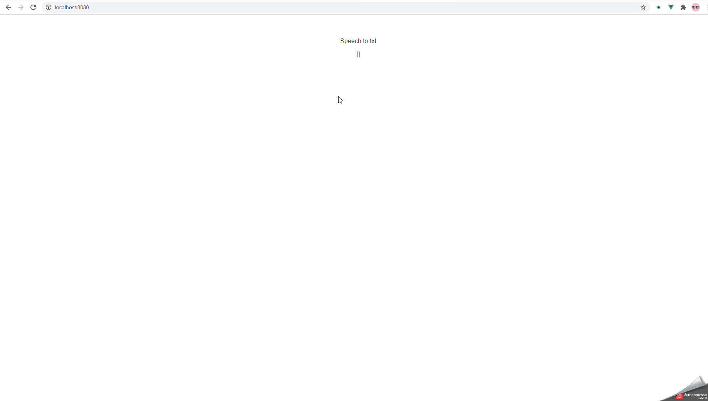

# Vue Speech to Text
Preview:



## Project setup
```
yarn install
```

### Compiles and hot-reloads for development
```
yarn serve
```

### Compiles and minifies for production
```
yarn build
```

### Lints and fixes files
```
yarn lint
```

### Change the Language.
```
The change of language is possible by change the lang_ of HelloWorld component data.
```
### Customize configuration
See [Configuration Reference](https://cli.vuejs.org/config/).
